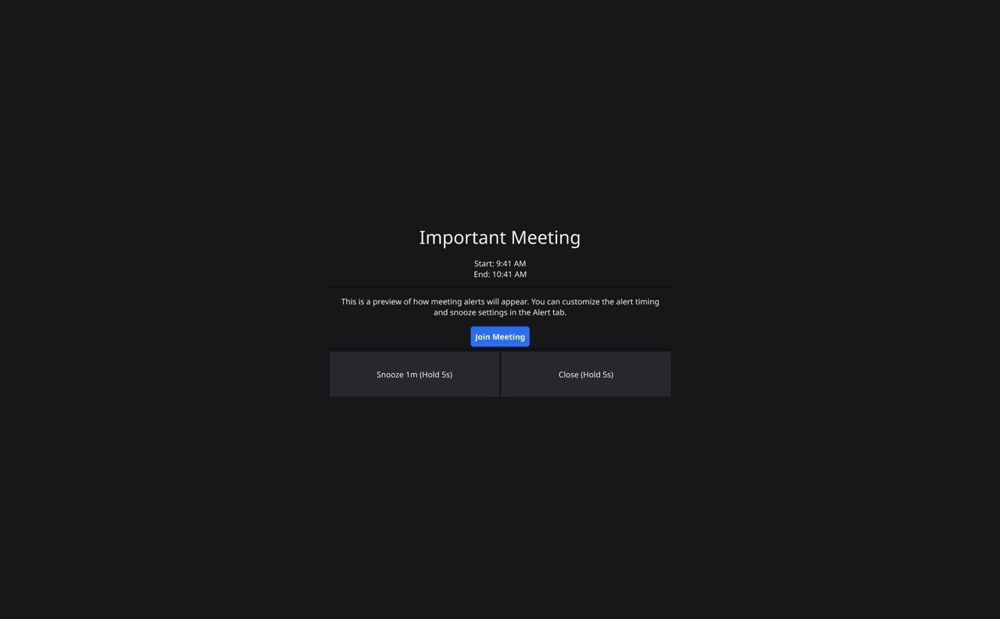
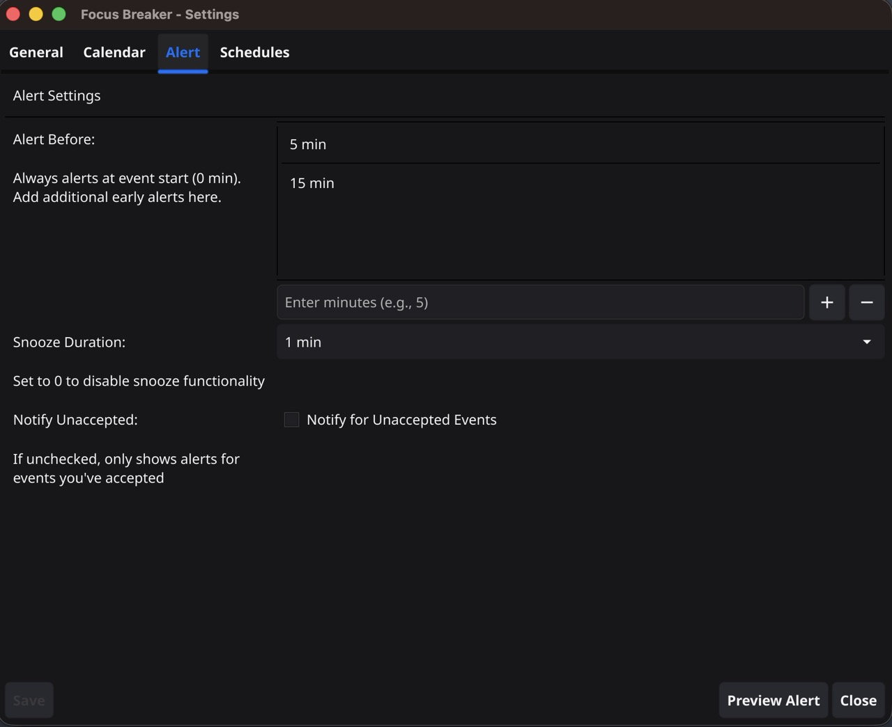

# Focus Breaker

Break your hyperfocus before you miss that important meeting.


## Inspiration

There are countless calendar apps to help people focus and reduce distractions. But when you're too focused, you miss meetings.

Deep in code or debugging, it's easy to lose track of time. Your meeting started 10 minutes ago. The doctor's office is calling. Your team is looking for you.

**No app helps you break hyperfocus when you need to.**

Focus Breaker syncs your calendar and displays a full-screen alert you can't ignore. No gentle notification or polite reminder you'll dismiss without thinking.

Hold-to-confirm buttons require 5 seconds to dismiss. If breaking focus was easy, you wouldn't need this app.

## Features

- **Full-Screen Alerts**: Impossible to ignore, covers your entire screen
- **Hold-to-Confirm Buttons**: 5-second hold required to dismiss or snooze (no accidental clicks)
- **Cheating Prevention**: Cmd + Q or switching window will NOT save you.
- **Multiple Alert Times**: Get notified 15 minutes before, 5 minutes before, or set custom times.
- **Native App**: Written in Golang, not Electron! Only ~30MB memory footprint
- **Smart Meeting Detection**: Automatically extracts Zoom, Google Meet, Teams, and Webex links
- **Multiple Calendar Support**: Sync multiple iCal sources (Google Calendar, Outlook, etc.)
- **Auto-start on Login**: Set it and forget it






## Installation

### Download Pre-built Binaries

Download the latest release for your platform from the [Releases page](https://github.com/borgmon/focus-breaker/releases):

- **macOS (Apple Silicon)**: `FocusBreaker-arm64.dmg`
- **Windows**: `focus-breaker-windows-amd64.exe`
- **Linux (amd64)**: `focus-breaker-linux-amd64.tar.gz`
- **Linux (arm64)**: `focus-breaker-linux-arm64.tar.gz`

### macOS Installation

1. Download `FocusBreaker-arm64.dmg`
2. Open the DMG file
3. Drag Focus Breaker to your Applications folder
4. Launch from Applications

### Windows Installation

1. Download `focus-breaker-windows-amd64.exe`
2. Run the executable

### Linux Installation

1. (the bin is built with wayland and flatpak in mind)
2. Install the flatpak:
   ```bash
   flatpak install focus-breaker.flatpak
   ```
3. Run:
   ```bash
   flatpak run io.github.borgmon.FocusBreaker
   ```

## Setup
It lives inside your system tray.

### Getting Your iCal URL

**Google Calendar:**
1. Open Google Calendar in your browser
2. Click the three dots next to your calendar name
3. Select "Settings and sharing"
4. Scroll to "Integrate calendar"
5. Copy the "Secret address in iCal format"

**Outlook/Office 365:**
1. Open Outlook Calendar
2. Click "Settings" → "View all Outlook settings"
3. Go to "Calendar" → "Shared calendars"
4. Under "Publish a calendar", select your calendar
5. Copy the ICS link

**Apple Calendar (iCloud):**
1. Open iCloud.com
2. Go to Calendar
3. Click the share icon next to your calendar
4. Enable "Public Calendar"
5. Copy the webcal URL and change `webcal://` to `https://`

## Development Guide

### Building from Source

```bash
# Clone the repository
git clone https://github.com/borgmon/focus-breaker.git
cd focus-breaker

# Install dependencies
go mod download

# Run in development mode
go run .

# Build executable
go build -o focus-breaker .
```

### Packaging

See github action.

## Contributing

Contributions are welcome! Please feel free to submit a Pull Request.
